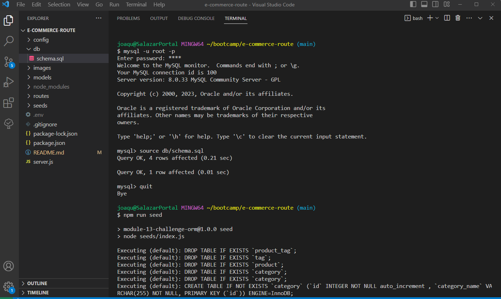

  

  # E-Commerce db Manager

  ## Description
  
  This repositoy contains the files for the backend of an e-commerce site. Using Express.js API and Sequelize to interact with a MySQL database, the app can be used to manage and join tables within a database. The user can retrieve all, retrieve one (by ID), add to, edit, and delete entries into the tables within the the database. The working app can be seen in the video below. The routes are shown using PostMan.

  ## Table of Contents

- [Installation](#installation)
- [Usage](#usage)
- [License](#license)
- [Contributing](#contribution)
- [Tests](#tests)
- [Questions](#questions)

## Installation

Go to https://github.com/joaqsala/e-commerce-route and clone the repository. Open the contents in VS Code or other editor. In the terminal, install all dependencies using npm i. Log into mysql2 using your mysql -u root -p, and then enter your password. Start your database by entering source db/schema.sql. Then, log off of mysql2. Run the seed data using npm run seed, and then start your server using node server.js.

## Usage 

Video walk through: https://watch.screencastify.com/v/VHpFaqf7k51vrp3cUu7w

Follow the steps in the installation instructions posted above, and then run node server.js. To see the existing categories, products, and tags in the database, open Postman, Insomia, or similar. In the address area, type localhost:3001/api/category, localhost:3001/api/products, or localhost:3001/api/tags. Make sure to use the GET option. To get a specific category, product, or tag by id, add `/#` in the address, where the # sign is the id number. To add, edit, or delete a specific category, product, or tag, use options POST, PUT, or DELETE, respectively.

## License

This project is covered under the MIT License.
 
  https://opensource.org/license/mit/

## Contribution

Contributions are always welcomed. Please submit a pull request.

## Tests

Test the app by adding and editing existing items in the database, and then viewing the results.

## Questions

For any questions, please feel free to reach out. 

Github username: https://github.com/joaqsala

Email: joaqsala@gmail.com
